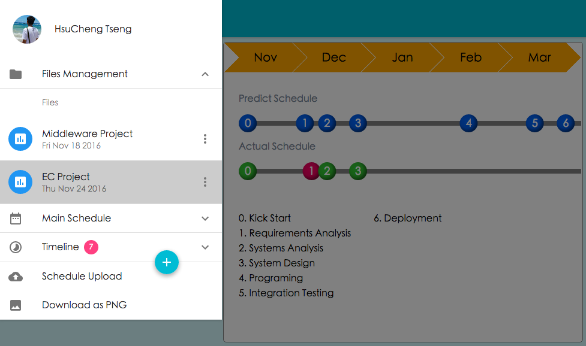
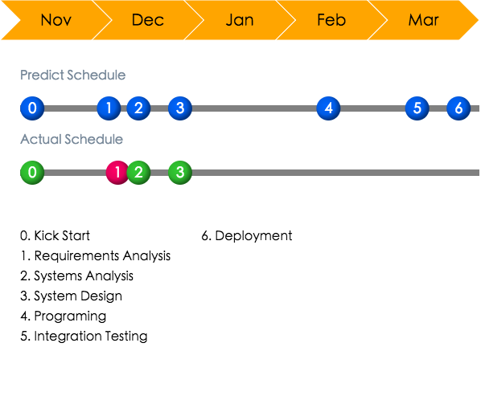
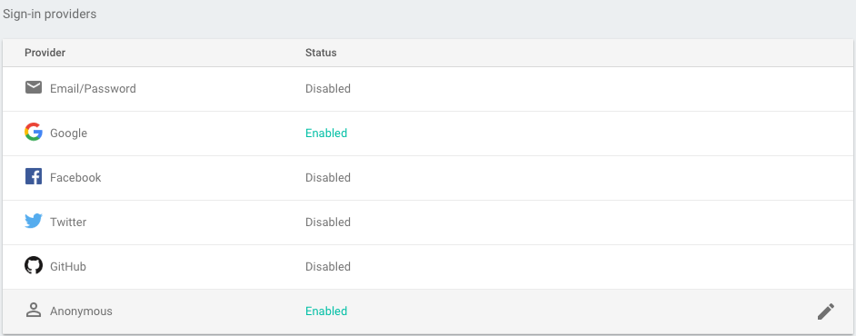
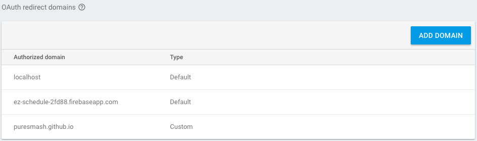

## About

This project is crafted to help users report the progress of their projects on weekly meetings. Instead of adjusting schedule diagram on slides every week, I want to offer a simpler and more accurate way to accomplish the progress visualization.

The project is using React.js as the frontend framework, and firebase realtime database plays the role of the backend (BaaS).

**Interface**



**Result**



## Install

Download Dependencies with npm.

```sh
npm install
```

Run the bellow scripts to package javascript and scss into assets.

```sh
# Production
npm run build

# Development
npm run watch
```

Because we are using [UglifyJs](https://github.com/mishoo/UglifyJS2) on production mode, the file name of bundle file is slightly different. Open `./public/index.html`, then modify `src="./assets/bundle.js"` to `src="./assets/bundle.min.js"`.

## Configuration

**Firebase**

Remember to enable providers and add domains for your app in your [firebase console](https://console.firebase.google.com/) under "Authentication > SIGN-IN METHOD" tag.




Modify database access rules like below

```json
{
  "rules": {
    "schedule":{
      "$uid":{
        ".read": "auth !== null && auth.uid == $uid",
        ".write": "auth !== null && auth.uid == $uid",
      }
    },
    "users":{
      "$uid":{
        ".read": "auth != null && auth.uid ==$uid"
      }
    },
    ".write": "auth != null"
  }
}
```
